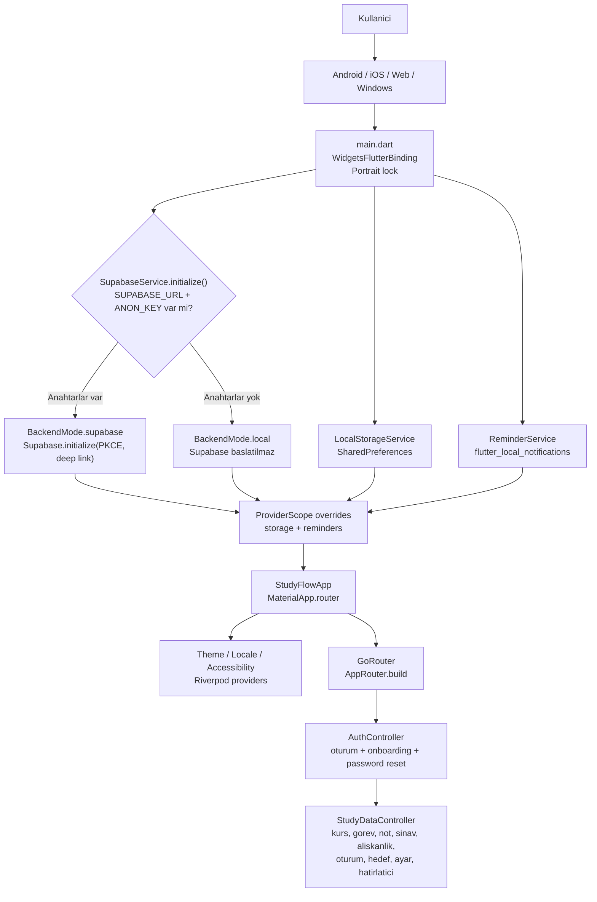
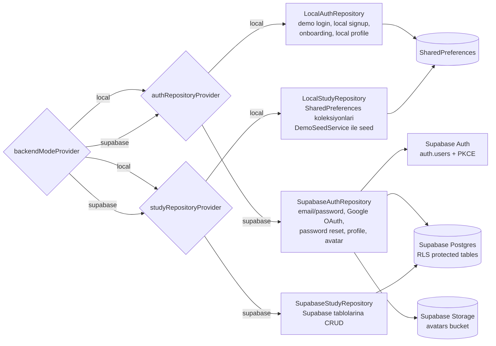
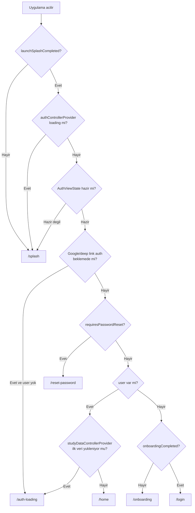
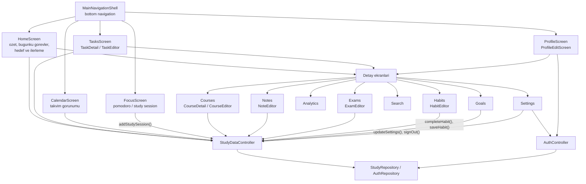
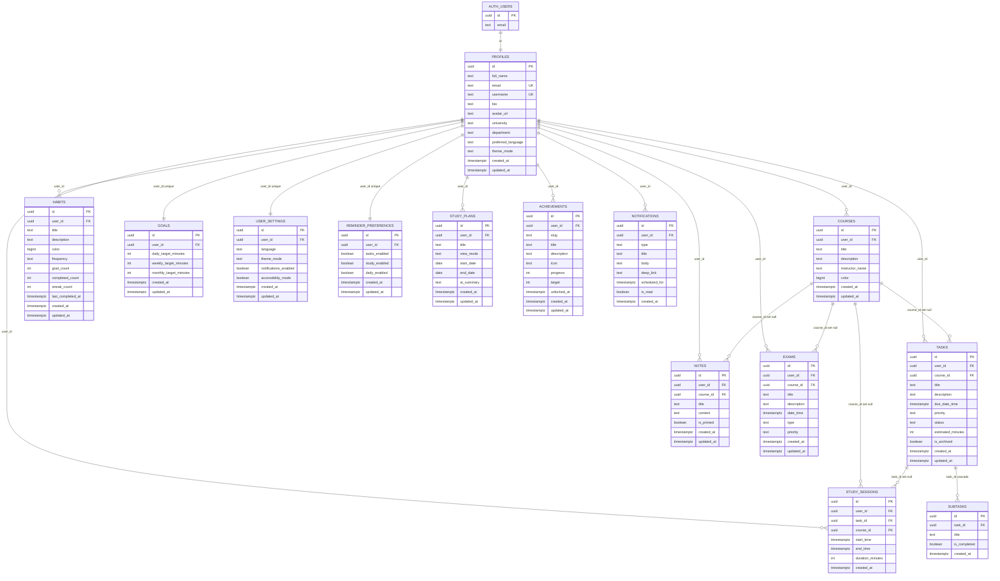

# StudyFlow Uygulama Calisma Semasi

Bu dokuman, mevcut koda gore StudyFlow uygulamasinin nasil acildigini,
hangi katmanlardan gectigini ve verinin local demo ya da Supabase modunda
nereye yazildigini gosterir.

## 1. Genel Uygulama Akisi

## 2. Repository Secimi ve Veri Katmani

## 3. Acilis ve Yonlendirme Karari

## 4. Ekranlar ve Islem Akisi

## 5. Supabase Veritabani ER Semasi

Bu ER semasi `supabase/migrations/001_initial_schema.sql`,
`002_mobile_premium_upgrade.sql` ve `003_auth_profile_defaults.sql`
dosyalarina gore hazirlanmistir.

## 6. En Kritik Davranislar

- Supabase anahtarlari yoksa uygulama crash olmaz; local demo moda gecer.
- Local modda auth, profil ve study data `SharedPreferences` uzerinde tutulur.
- Supabase modda auth islemleri Supabase Auth ile; uygulama verileri Supabase
  tablolarinda RLS ile sadece kullanicinin kendi verisine aciktir.
- Kullanici login/signup/Google OAuth ile oturum actiginda `AuthController`
  profil bilgisini alir, `StudyRepository.ensureSeeded()` cagrilir, sonra
  `StudyDataController` tum ana koleksiyonlari yukler.
- Ekranlar dogrudan veritabanina gitmez; Riverpod controller ve repository
  katmani uzerinden okuma/yazma yapar.
- Ayar degisikligi once Riverpod state/local preference tarafina yansir,
  sonra repository uzerinden kalici hale getirilir.
- Focus ekrani calisma suresi bitince `addStudySession()` ile yeni
  `study_sessions` kaydi olusturur.
- Habit tamamlama `completeHabit()` ile `completed_count`, gerekirse
  `streak_count` gunceller.
