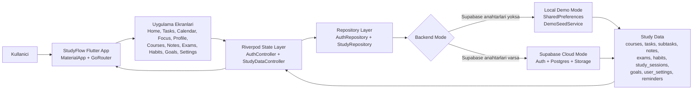

# StudyFlow Slayt Icin Tek Sayfalik Sema

Bu sema sunuma koymak icin sade tutuldu. Detayli teknik sema
`docs/application_schema.md` dosyasinda duruyor.

## Slayt Altina Kisa Aciklama

StudyFlow, Flutter ile gelistirilmis bir calisma planlama uygulamasidir.
Uygulama acildiginda GoRouter kullaniciyi auth durumuna gore yonlendirir.
Ekranlar veriye dogrudan erismez; Riverpod controller katmani uzerinden
repository katmanina gider. Supabase ayarlari varsa veri bulutta saklanir,
yoksa uygulama local demo modda SharedPreferences ile calisir.

## Sunum Icin Daha Kisa Versiyon

StudyFlow'da kullanici islemleri once Flutter ekranlarindan Riverpod state
katmanina gider. Auth ve study data controller'lari repository katmanini
kullanarak veriyi local demo modda SharedPreferences'a, cloud modda ise
Supabase Auth, Postgres ve Storage'a yazar.
